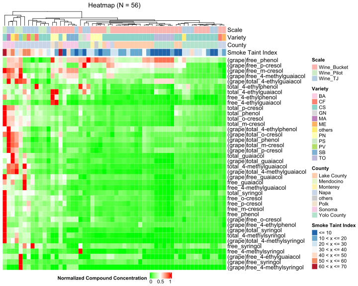
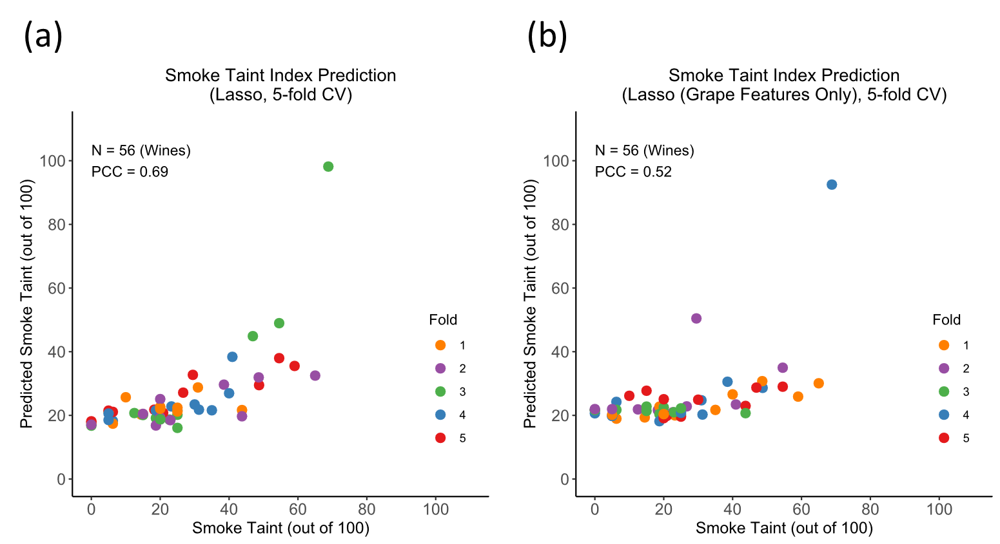
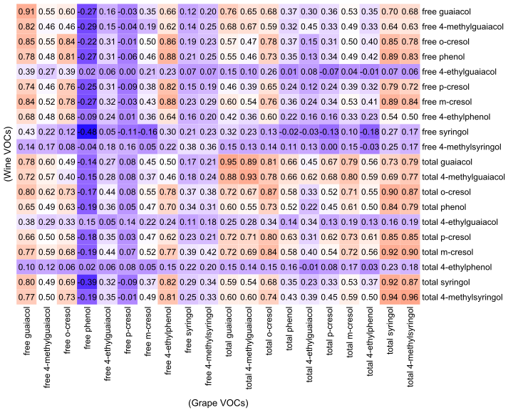

# Smoke Taint Prediction
## Overview

### Introduction
Aromatic compounds in wildfire smoke significantly impact the taste, odor, and value of wine. The aim of this project is finding the correlation between those volatile organic compounds (VOCs) and human-evaluated smoke taint indices. 

*Figure 1. Overview: The aim of the project is predicting smoke taint index given concentrations of volatile organic compounds (VOCs) measured in grapes and wines. Different models including linear (Lasso), support vector regression (SVR), and random forest are applied.*

### Summary of methods
This package contains four parts. Although the number implies the order of the entire analysis procedure, each part can be executed independently.
 1. Outlier detection:
 This part checks the consistencies among replicates of VOC concentration measurements. 
     - The grape VOC concentrations are measured in triplicate, and the code evaluate the relative standard deviation (standard deviation divided by average) among triplicates for each sample, each VOC. Then for each VOC, the samples with abnormally high relative standard deviation will be labeled.
     -  The wine VOC concentrations are measured in duplicate, and the code evaluate the relative absolute difference (absolute difference divided by average) between duplicates for each sample, each VOC. Then for each VOC, the samples with abnormally high absolute difference deviation will be labeled.
 2. General data analysis
 This part processes the replicates by taking the median (for triplicate measurements) or average (for duplicate measurements) and then does the general analysis including the following items:
     - Plotting the heatmap of the VOC intensities of wine samples in the dataset.
     - PCA analysis
     - t-SNE analysis
     - Univariate analysis
 3. Smoke taint index prediction
 This part predict the Smoke taint index using three different model:
     - Linear (Lasso)
     - Support Vector Regression (SVR)
     - Random Forest
 4. Correlation between grape VOC concentrations and wine VOC concentrations
 The correlation between grape VOC concentrations and wine VOC concentrations are observed.
 
### Results

     *Figure 2. The heatmap of VOC intensities of wine samples in the entire dataset. Each row represents different VOCs detected in grapes and wines, and each column represents different wine samples.*

     *Figure 3. Performance evaluation plot of the linear model generated from this part of the code.*

 *Figure 4. Correlations between grape VOC concentration and wine VOC concentrations. Concentration of free phenol in grape (the fourth column) is negative correlated with the concentration of wine VOCs.*

## Prerequisites
The entire package (except the training and flavor prediction of neural network model which is implemented in Python) is implemented in R and tested with the environment R version 3.6.1 (with RStudio version 2022.02.3 Build 492).
(Please refer the corresponding readme file for each component.)

### Installation (in R environment):

 **Note: If you use Ubuntu OS, please install the [development version](https://packages.ubuntu.com/focal/r-base-dev) of R (`r-base-dev`):**
 `sudo apt-get install r-base-dev`
 
Commands for installing all required R packages:

    #In R environment
    install.packages("RColorBrewer")
    install.packages("circlize")
    install.packages("ggplot2")
    install.packages("tsne")
    install.packages("glmnet")
    install.packages("e1071")
    if (!require("BiocManager", quietly = TRUE))
    install.packages("BiocManager")
    BiocManager::install("ComplexHeatmap")
    BiocManager::install("preprocessCore")

### Required code modification before running
In addition, it is necessary to specify the working directory correctly. Please go to Line 3-5 in code files and set the main directory which contains code and data directory as the working directory (NOT the directory the contains the code).

### Run the code
You can run the code in RStudio IDE or run the code in the console, for example:

    Rscript 0_outlier_detection.r
    Rscript 1_general_analysis.r
    Rscript 2_smoke_taint_prediction.r
    Rscript 3_cor_grape_voc_vs_wine_voc.r

## Outputs
The outputs generated from four parts of the code will be stored in their output directories respectively (please refer the example output directory).

## Request the dataset and contact information
Please contact us at [tagkopouloslab@ucdavis.edu](mailto:tagkopouloslab@ucdavis.edu) if you need the dataset for analysis or have any issues of running the code .

## Acknowledgements

-   [Anita Oberholster](https://wineserver.ucdavis.edu/people/anita-oberholster#/) for providing the VOC concentration dataset of wine and grape samples.

## Funding

-   USDA-NIFA AI Institute for Next Generation Food Systems (AIFS), USDA-NIFA award number 2020-67021-32855.