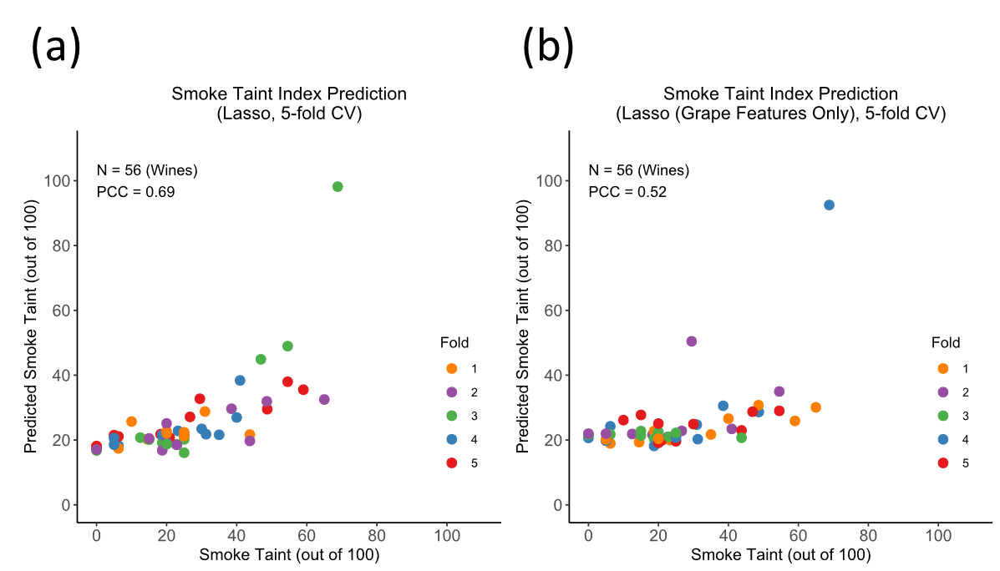

# Smoke Taint Prediction
## Overview
Aromatic compounds in wildfire smoke significantly impact the taste, odor, and value of wine. The aim of this project is finding the correlation between those volatile organic compounds (VOCs) and human-evaluated smoke taint indices. 

*Figure 1. Overview: The aim of the project is predicting smoke taint index given concentrations of volatile organic compounds (VOCs) measured in grapes and wines. Different models including linear (Lasso), support vector regression (SVR), and random forest are applied.*
## Source code
The source code contains four parts. Although the number implies the order of the entire analysis procedure, each part can be executed independently.
 1. Outlier detection:
 This part checks the consistencies among replicates of VOC concentration measurements. 
     - The grape VOC concentrations are measured in triplicate, and the code evaluate the relative standard deviation (standard deviation divided by average) among triplicates for each sample, each VOC. Then for each VOC, the samples with abnormally high relative standard deviation will be labeled.
     -  The wine VOC concentrations are measured in duplicate, and the code evaluate the relative absolute difference (absolute difference divided by average) between duplicates for each sample, each VOC. Then for each VOC, the samples with abnormally high absolute difference deviation will be labeled.
 2. General data analysis
 This part processes the replicates by taking the median (for triplicate measurements) or average (for duplicate measurements) and then does the general analysis including the following items:
     - Plotting the heatmap of the VOC intensities of wine samples in the dataset.
     
     *Figure 2. The heatmap of VOC intensities of wine samples in the entire dataset. Each row represents different VOCs detected in grapes and wines, and each column represents different wine samples.*
     - PCA analysis
     - t-SNE analysis
     - Univariate analysis
 3. Smoke taint index prediction
 This part predict the Smoke taint index using three different model:
     - Linear (Lasso)
     
     *Figure 3. Performance evaluation plot of the linear model generated from this part of the code.*
     - Support Vector Regression (SVR)
     - Random Forest
 4. Correlation between grape VOC concentrations and wine VOC concentrations
 The correlation between grape VOC concentrations and wine VOC concentrations are observed.
 
 *Figure 4. Correlations between grape VOC concentration and wine VOC concentrations. Concentration of free phenol in grape (the fourth column) is negative correlated with the concentration of wine VOCs.*

## Run the source code

The code is written in R and is tested with the environment R version 3.6.1 (with RStudio version 2022.02.3 Build 492).
The following packages should be installed before running the source code:
 - Packages can be found in CRAN (so that you can install them using standard command "install.packages()" directly):
     - RColorBrewer
     - circlize
     - ggplot2
     - tsne
     - glmnet
     - e1071
 - Packages can be found in [Bioconductor](https://bioconductor.org/news/bioc_3_9_release/):
    - ComplexHeatmap
    - preprocessCore

In addition, it is necessary to specify the working directory correctly. Please go to Line 3-5 in code files and set the main directory which contains code and data directory as the working directory (NOT the directory the contains the code).

## Outputs
The outputs generated from four parts of the code will be stored in their output directories respectively (please refer the example output directory).

## Contact
Please contact the author (ChengEn Tan, cetan@ucdavis.edu) if you have any questions for running the code.
